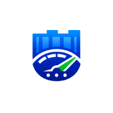

<p align="center">
  
</p>

<h1 align="center">DockPit</h1>

<p align="center">
  <strong>A modern, self-hosted Docker management platform with a futuristic web UI.</strong><br>
  Monitor, manage, and secure your containers across multiple servers — all from one dashboard.
</p>

<p align="center">
  <a href="https://github.com/amslertec/dockpit/releases/latest"></a>
  <a href="https://github.com/amslertec/dockpit/blob/main/LICENSE"></a>
  <a href="https://hub.docker.com/r/amslertec/dockpit"></a>
  <a href="https://hub.docker.com/r/amslertec/dockpit"></a>
  <a href="https://github.com/sponsors/amslertec"></a>
  <a href="https://www.buymeacoffee.com/amslertec"></a>
</p>

---

## What is DockPit?

DockPit is a **self-hosted Docker management platform** built from the ground up with Rust and SvelteKit. It gives you full control over your Docker infrastructure through a sleek, responsive web interface — without sending any data to external services.

**Why DockPit?**

- **Fast** — Rust backend with zero-overhead Docker socket communication
- **Lightweight** — Single binary + SQLite, no external dependencies
- **Multi-Server** — Manage local and remote Docker hosts from one UI via the DockPit Agent
- **Secure** — Group-based permissions, 2FA, JWT auth, CSRF protection, CSP headers
- **Beautiful** — Glassmorphism design with dark/light mode, fully responsive

---

## Key Features

### Infrastructure Management

| Feature | Description |
|---------|-------------|
| **Containers** | Full lifecycle — start, stop, restart, recreate, rollback, migrate, bulk actions |
| **Container Detail** | Full inspect view — env vars, ports, volumes, labels, networks, health |
| **Container Rollback** | Automatic snapshots before recreate, one-click restore to any version |
| **Container Migration** | Move containers/stacks between servers with registry credential propagation |
| **Compose Stacks** | Create, deploy, edit docker-compose.yml with YAML validation |
| **Stack Templates** | 10 pre-built templates + custom templates with icon picker |
| **Images** | Pull, inspect, delete, prune; update detection via registry digest comparison |
| **Volumes & Networks** | View, delete, prune unused resources |
| **Web Terminal** | Interactive shell access to any container (xterm.js + WebSocket) |
| **Host Terminal** | Direct shell access to Docker host servers via nsenter |
| **Shell Snippets** | Save and one-click execute frequently used commands per container |
| **Log Viewer** | Real-time log streaming with ANSI colors and download |

### Monitoring & Observability

| Feature | Description |
|---------|-------------|
| **Live Resource Monitor** | Real-time CPU, RAM, Network I/O per container via WebSocket |
| **Health Check Dashboard** | Docker HEALTHCHECK status, failing streaks, health logs |
| **Container Events** | Live timeline of start/stop/restart/OOM events |
| **Update Detection** | Registry digest comparison — detects outdated images without pulling |
| **Container Diff** | Compare snapshots — see what changed between container versions |
| **Vulnerability Scanner** | CVE scanning with severity breakdown and NVD links |
| **Prometheus Metrics** | `/api/metrics` endpoint for Grafana dashboards |

### Security & Access Control

| Feature | Description |
|---------|-------------|
| **Group-Based Permissions** | Granular per-page and per-action permission system |
| **Default Groups** | DockPit, Admin, Editor, Viewer with configurable permissions |
| **5 User Roles** | Super Admin, Admin, Editor, Viewer, User |
| **Two-Factor Auth (2FA)** | TOTP with QR code + 8 backup codes |
| **Audit Log** | Hash-chain integrity, every action logged |
| **CSRF + CSP** | Origin validation, Content-Security-Policy headers |
| **Token Refresh** | 2-hour JWT with automatic silent refresh |

### Automation & Notifications

| Feature | Description |
|---------|-------------|
| **Smart Alerts** | Auto-fix rules — container crash → auto-restart, disk full → auto-prune |
| **Scheduled Jobs** | Cron-like automation — update checks, system prune, stack redeploy |
| **Email Notifications** | Per-user SMTP email with configurable preferences |
| **Webhooks** | Slack, Discord, Microsoft Teams integration |
| **Notification Center** | In-app notifications with per-type preferences |

### UX & Customization

| Feature | Description |
|---------|-------------|
| **Customizable Dashboard** | Drag-and-drop widgets, multiple tabs, colors, import/export |
| **Command Palette** | `Ctrl+K` to search containers, stacks, servers instantly |
| **Dark & Light Mode** | Glassmorphism design with gradient accents |
| **i18n** | English and German |
| **PWA** | Installable as mobile/desktop app |
| **Fully Responsive** | Mobile-optimized with touch controls |

---

## Quick Start

### 1. Deploy DockPit

```yaml
services:
  dockpit:
    image: amslertec/dockpit:latest
    container_name: dockpit
    restart: unless-stopped
    network_mode: host
    pid: host
    privileged: true
    volumes:
      - dockpit_data:/data
      - /var/run/docker.sock:/var/run/docker.sock:ro
      - /var/docker/container:/stacks
    environment:
      - DOCKPIT_PORT=5533
      - DOCKPIT_JWT_SECRET=change-me-to-a-secure-random-string
      - DOCKPIT_STACKS_DIR=/stacks
      - DOCKPIT_HTTPS_PORT=5539

volumes:
  dockpit_data:
```

```bash
docker compose up -d
```

Open **http://your-server:5533** (HTTP) or **https://your-server:5539** (HTTPS) and create your admin account.

### 2. Add Remote Servers (Optional)

Deploy the **DockPit Agent** on any remote Docker host:

```yaml
services:
  dockpit-agent:
    image: amslertec/dockpit-agent:latest
    container_name: dockpit-agent
    restart: unless-stopped
    pid: host
    privileged: true
    ports:
      - "5522:5522"
    volumes:
      - /var/run/docker.sock:/var/run/docker.sock:ro
      - /var/docker/container:/stacks
    environment:
      - AGENT_STACKS_DIR=/stacks
```

Then connect in DockPit under **Environments → Connect Remote Server** or use **Network Scan** to auto-discover agents.

---

## Environment Variables

| Variable | Default | Description |
|----------|---------|-------------|
| `DOCKPIT_PORT` | `5533` | HTTP port |
| `DOCKPIT_HTTPS_PORT` | `5539` | HTTPS port (auto-generated self-signed certificate) |
| `DOCKPIT_JWT_SECRET` | — | **Required.** Secret key for JWT tokens (min. 16 characters) |
| `DOCKPIT_DB_PATH` | `/data/dockpit.db` | SQLite database path |
| `DOCKPIT_STACKS_DIR` | `/stacks` | Docker Compose stacks directory |

---

## Prometheus Integration

```yaml
scrape_configs:
  - job_name: 'dockpit'
    scrape_interval: 30s
    static_configs:
      - targets: ['your-server:5533']
    metrics_path: '/api/metrics'
```

---

## Tech Stack

| Layer | Technology |
|-------|-----------|
| **Backend** | Rust + Axum |
| **Frontend** | SvelteKit 5 + TypeScript |
| **Styling** | Tailwind CSS 4 + Custom Design System |
| **Database** | SQLite (rusqlite) |
| **Terminal** | xterm.js + WebSocket |
| **Dashboard** | GridStack.js |
| **Docker** | Bollard (API) + Docker CLI + Compose v2 |
| **Auth** | JWT + TOTP (2FA) + bcrypt |
| **Email** | lettre (SMTP) |

---

## Development

### Prerequisites

- Rust 1.75+
- Node.js 20+
- Docker

### Run locally

```bash
# Frontend (hot reload)
cd frontend && npm install && npm run dev

# Backend
cargo run --bin dockpit-server
```

### Build Docker image

```bash
docker compose build
```

---

## Contributing

Contributions are welcome! Please open an issue or pull request on [GitHub](https://github.com/amslertec/dockpit).

## Sponsor

If you find DockPit useful, consider supporting the project:

- [GitHub Sponsors](https://github.com/sponsors/amslertec)
- [Buy Me a Coffee](https://www.buymeacoffee.com/amslertec)

## License

[MIT](LICENSE)
